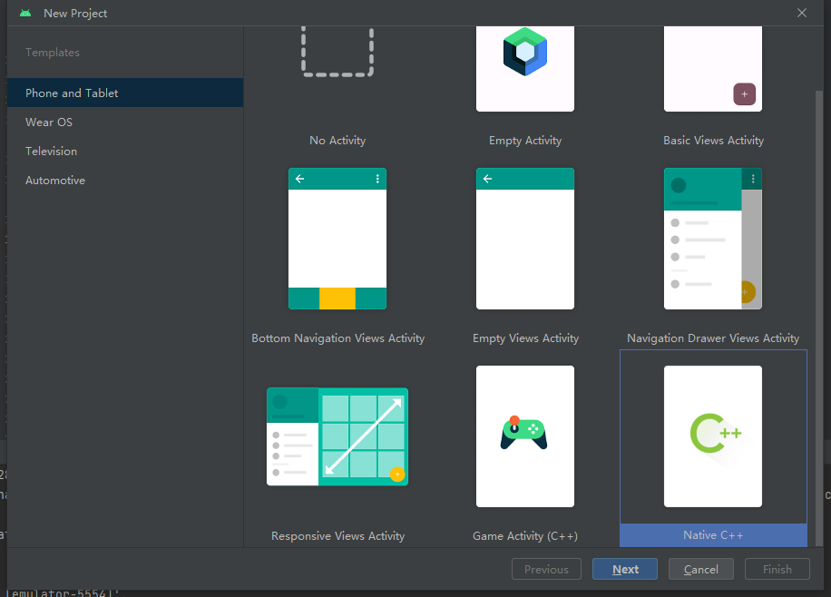
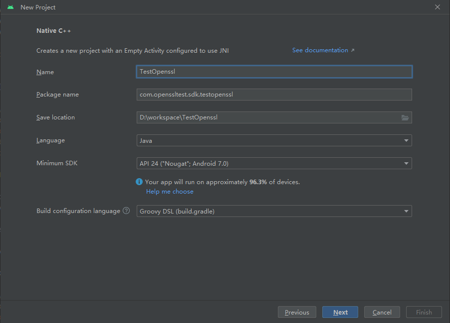
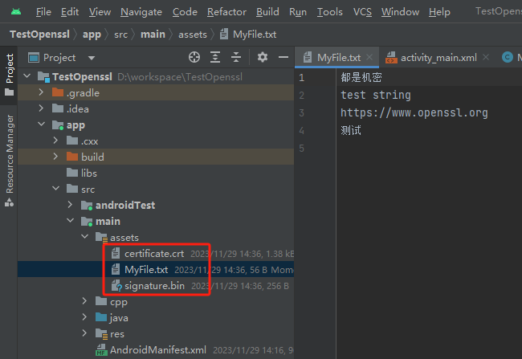
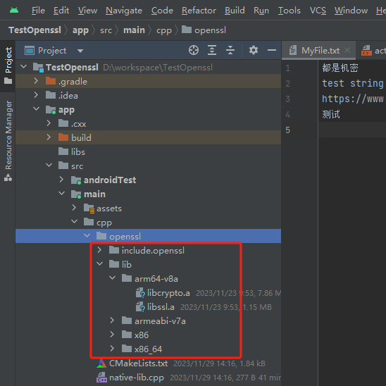
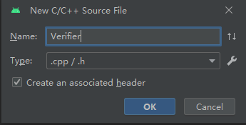
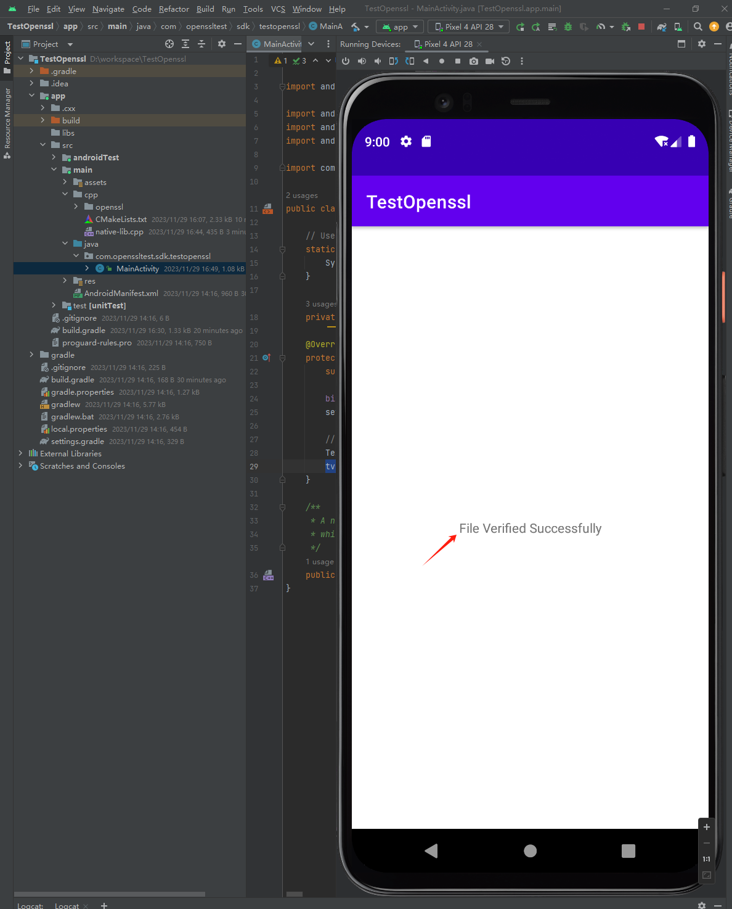
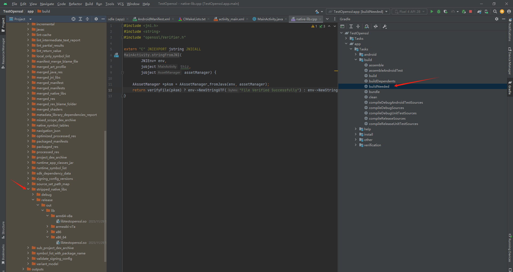

# 安卓

- Android Studio：https://developer.android.google.cn/studio?hl=zh-cn
- NDK：https://github.com/android/ndk/wiki/Unsupported-Downloads ，这里使用 21e
- OpenSSL 安卓编译指南：https://wiki.openssl.org/index.php/Android
- OpenSSL 安卓编译脚本：https://github.com/217heidai/openssl_for_android

## 编译 OpenSSL 静态库

以下操作我是在 Windows 10 下 WSL2 的 Ubuntu 环境里完成的。

`build.sh` 脚本：

```bash
#!/bin/bash -e

WORK_PATH=/mnt/d/workspace/openssl-3.0.12
#$(cd "$(dirname "$0")";pwd)
ANDROID_NDK_PATH=/home/tattoo/workspace/android-ndk-r21e
OPENSSL_SOURCES_PATH=${WORK_PATH}
ANDROID_TARGET_API=21
ANDROID_TARGET_ABI=$1
OUTPUT_PATH=${WORK_PATH}/openssl_3.0.12_${ANDROID_TARGET_ABI}

OPENSSL_TMP_FOLDER=/tmp/openssl_${ANDROID_TARGET_ABI}
mkdir -p ${OPENSSL_TMP_FOLDER}
cp -r ${OPENSSL_SOURCES_PATH}/* ${OPENSSL_TMP_FOLDER}

function build_library {
    mkdir -p ${OUTPUT_PATH}
    make && make install
    rm -rf ${OPENSSL_TMP_FOLDER}
    rm -rf ${OUTPUT_PATH}/bin
    rm -rf ${OUTPUT_PATH}/share
    rm -rf ${OUTPUT_PATH}/ssl
    rm -rf ${OUTPUT_PATH}/lib/engines*
    rm -rf ${OUTPUT_PATH}/lib/pkgconfig
    rm -rf ${OUTPUT_PATH}/lib/ossl-modules
    echo "Build completed! Check output libraries in ${OUTPUT_PATH}"
}

if [ "$ANDROID_TARGET_ABI" == "armeabi-v7a" ]
then
    export ANDROID_NDK_ROOT=${ANDROID_NDK_PATH}
    PATH=$ANDROID_NDK_ROOT/toolchains/llvm/prebuilt/linux-x86_64/bin:$ANDROID_NDK_ROOT/toolchains/arm-linux-androideabi-4.9/prebuilt/linux-x86_64/bin:$ANDROID_NDK_ROOT/toolchains/aarch64-linux-android-4.9/prebuilt/linux-x86_64/bin:$PATH
    cd ${OPENSSL_TMP_FOLDER}
    ./Configure android-arm -D__ANDROID_API__=${ANDROID_TARGET_API} -static no-asm no-shared no-tests --prefix=${OUTPUT_PATH}
    build_library

elif [ "$ANDROID_TARGET_ABI" == "arm64-v8a" ]
then
    export ANDROID_NDK_ROOT=${ANDROID_NDK_PATH}
    PATH=$ANDROID_NDK_ROOT/toolchains/llvm/prebuilt/linux-x86_64/bin:$ANDROID_NDK_ROOT/toolchains/arm-linux-androideabi-4.9/prebuilt/linux-x86_64/bin:$ANDROID_NDK_ROOT/toolchains/aarch64-linux-android-4.9/prebuilt/linux-x86_64/bin:$PATH
    cd ${OPENSSL_TMP_FOLDER}
    ./Configure android-arm64 -D__ANDROID_API__=${ANDROID_TARGET_API} -static no-asm no-shared no-tests --prefix=${OUTPUT_PATH}
    build_library

elif [ "$ANDROID_TARGET_ABI" == "x86" ]
then
    export ANDROID_NDK_ROOT=${ANDROID_NDK_PATH}
    PATH=$ANDROID_NDK_ROOT/toolchains/llvm/prebuilt/linux-x86_64/bin:$ANDROID_NDK_ROOT/toolchains/arm-linux-androideabi-4.9/prebuilt/linux-x86_64/bin:$ANDROID_NDK_ROOT/toolchains/aarch64-linux-android-4.9/prebuilt/linux-x86_64/bin:$PATH
    cd ${OPENSSL_TMP_FOLDER}
    ./Configure android-x86 -D__ANDROID_API__=${ANDROID_TARGET_API} -static no-asm no-shared no-tests --prefix=${OUTPUT_PATH}
    build_library

elif [ "$ANDROID_TARGET_ABI" == "x86_64" ]
then
    export ANDROID_NDK_ROOT=${ANDROID_NDK_PATH}
    PATH=$ANDROID_NDK_ROOT/toolchains/llvm/prebuilt/linux-x86_64/bin:$ANDROID_NDK_ROOT/toolchains/arm-linux-androideabi-4.9/prebuilt/linux-x86_64/bin:$ANDROID_NDK_ROOT/toolchains/aarch64-linux-android-4.9/prebuilt/linux-x86_64/bin:$PATH
    cd ${OPENSSL_TMP_FOLDER}
    ./Configure android-x86_64 -D__ANDROID_API__=${ANDROID_TARGET_API} -static no-asm no-shared no-tests --prefix=${OUTPUT_PATH}
    build_library

else
    echo "Unsupported target ABI: $ANDROID_TARGET_ABI"
    exit 1
fi
```

将上面的脚本放置到 OpenSSL 源码目录，修改目录路径（`WORK_PATH` 为源码路径，`ANDROID_NDK_PATH` 为 NDK 安装路径）后，执行下面的语句来编译出 4 个架构的静态库：

```bash
./build.sh armeabi-v7a
./build.sh arm64-v8a
./build.sh x86
./build.sh x86_64
```

输出的库文件、头文件目录在源码目录下的 `openssl_3.0.12_arm64-v8a`、`openssl_3.0.12_armeabi-v7a`、`openssl_3.0.12_x86`、`openssl_3.0.12_x86_64`，其中 `include` 目录下的头文件完全一致，只需要拷贝一份即可。

### 错误修复

使用官包在 Android Studio 里编译时可能出现如下错误：

```
cmd.exe /C "cd . && C:\Users\tattoo\AppData\Local\Android\Sdk\ndk\25.1.8937393\toolchains\llvm\prebuilt\windows-x86_64\bin\clang++.exe --target=x86_64-none-linux-android24 --sysroot=C:/Users/tattoo/AppData/Local/Android/Sdk/ndk/25.1.8937393/toolchains/llvm/prebuilt/windows-x86_64/sysroot -fPIC -g -DANDROID -fdata-sections -ffunction-sections -funwind-tables -fstack-protector-strong -no-canonical-prefixes -D_FORTIFY_SOURCE=2 -Wformat -Werror=format-security   -fno-limit-debug-info  -static-libstdc++ -Wl,--build-id=sha1 -Wl,--no-rosegment -Wl,--fatal-warnings -Wl,--gc-sections -Wl,--no-undefined -Qunused-arguments -shared -Wl,-soname,libsignverify.so -o D:\workspace\signverify\app\build\intermediates\cxx\Debug\n6l545p2\obj\x86_64\libsignverify.so CMakeFiles/signverify.dir/signverify/Verifier.cpp.o CMakeFiles/signverify.dir/native-lib.cpp.o  D:/workspace/signverify/app/src/main/cpp/signverify/lib/x86_64/libssl.a  D:/workspace/signverify/app/src/main/cpp/signverify/lib/x86_64/libcrypto.a  -landroid  -llog  -latomic -lm && cd ."

ld: error: relocation R_X86_64_PC32 cannot be used against symbol 'bio_type_lock'; recompile with -fPIC
>>> defined in D:/workspace/signverify/app/src/main/cpp/signverify/lib/x86_64/libcrypto.a(libcrypto-lib-bio_meth.o)
>>> referenced by bio_meth.c
>>>               libcrypto-lib-bio_meth.o:(BIO_get_new_index) in archive D:/workspace/signverify/app/src/main/cpp/signverify/lib/x86_64/libcrypto.a
```


这是因为在前面编译 OpenSSL 库时，需要每一个 .o 文件都使用 `-fPIC` 选项。这里修改了 OpenSSL 源码目录下 `Configurations\00-base-templates.conf` 的内容，加上了 `-fPIC` ：

```perl
# -*- Mode: perl -*-
my %targets=(
    DEFAULTS => {
    template    => 1,

    cflags        => "-fPIC",
    cppflags    => "-fPIC",
    lflags        => "-fPIC",
    defines        => [],
    includes    => [],
    lib_cflags    => "-fPIC",
    lib_cppflags    => "-fPIC",
    lib_defines    => [],
    thread_scheme    => "(unknown)", # Assume we don't know
    thread_defines    => [],

    unistd        => "<unistd.h>",
    shared_target    => "-fPIC",
    shared_cflag    => "-fPIC",
    shared_defines    => [],
    shared_ldflag    => "-fPIC",
    shared_rcflag    => "",
```

## 将 OpenSSL 库引入 Android Studio

### 创建 NDK 项目

打开 Android Studio，创建一个新的 Native C++ 项目：



语言选择 `Java`，Build configuration language 选择 `Groovy DSL`：


其它选择缺省值，这样一个新的项目就创建成功了。

切换到 **Project** 视图，在 **app -> src -> main** 上单击鼠标右键，创建一个新目录 `assets`：


然后把前面我们生成的证书、签名和测试文件都拷贝到 `assets` 目录下：


在 **app -> src -> main -> cpp** 上单击鼠标右键，创建一个新目录 `openssl`，然后把前面编译的 OpenSSL 静态库和头文件目录都拷贝到里面：



在 `openssl` 目录下创建两个文件 `Verifier.cpp` 和 `Verifier.h`。



`Verifier.h`：

```cpp
#ifndef TESTOPENSSL_VERIFIER_H
#define TESTOPENSSL_VERIFIER_H

#include <iostream>
#include <fstream>
#include <sstream>
#include <vector>
#include <algorithm>
#include <iterator>
#include <cstring>
#include <numeric>
#include <openssl/rsa.h>
#include <openssl/pem.h>
#include <openssl/evp.h>
#include <openssl/x509.h>
#include <openssl/bio.h>
#include <openssl/err.h>

#include <android/log.h>
#include <android/asset_manager_jni.h>
#include <android/asset_manager.h>

using namespace std;

bool verifyFile(AAssetManager *pAsm);
X509 *loadCertificate(const string &certEntityString);
string getKeyStrFromPublickKey(EVP_PKEY *publicKey);
bool verifySignature(const string &data, const string &publicKeyStr, const string &signatureStr);

#endif //TESTOPENSSL_VERIFIER_H
```

`Verifier.cpp`：

```cpp
#include "Verifier.h"

bool verifyFile(AAssetManager *pAsm)
{
    AAsset *assetSign = AAssetManager_open(pAsm, "signature.bin", AASSET_MODE_UNKNOWN);
    AAsset *assetCert = AAssetManager_open(pAsm, "certificate.crt", AASSET_MODE_UNKNOWN);
    AAsset *assetFile = AAssetManager_open(pAsm, "MyFile.txt", AASSET_MODE_UNKNOWN);

    if (NULL == assetSign || NULL == assetCert || NULL == assetFile) {
        __android_log_print(ANDROID_LOG_INFO, __FUNCTION__, "failed to read file, signature or certificate assets");
        return false;
    }

    // 获取文件内容
    off_t bufferSignSize = AAsset_getLength(assetSign);
    char *bufferSign = (char *) malloc(bufferSignSize + 1);
    bufferSign[bufferSignSize] = 0;
    int numSignRead = AAsset_read(assetSign, bufferSign, bufferSignSize);

    off_t bufferCertSize = AAsset_getLength(assetCert);
    char *bufferCert = (char *) malloc(bufferCertSize + 1);
    bufferCert[bufferCertSize] = 0;
    int numCertRead = AAsset_read(assetCert, bufferCert, bufferCertSize);

    off_t bufferFileSize = AAsset_getLength(assetFile);
    char *bufferFile = (char *) malloc(bufferFileSize + 1);
    bufferFile[bufferFileSize] = 0;
    int numFileRead = AAsset_read(assetFile, bufferFile, bufferFileSize);

    X509 *certificate = loadCertificate(bufferCert);

    // Create a signature object
    EVP_MD_CTX *mdctx = EVP_MD_CTX_new();
    const EVP_MD *md = EVP_sha256();
    EVP_MD_CTX_init(mdctx);
    EVP_VerifyInit_ex(mdctx, md, NULL);

    // Initialize the signature verification, extract the public key from the certificate
    EVP_PKEY *publicKey = X509_get_pubkey(certificate);
    if (publicKey == nullptr)
    {
        std::cout << "Cannot get public key" << std::endl;
        return 1;
    }

    // PEM_write_PUBKEY(stdout, publicKey);  //print public key
    string publicKeyStr = getKeyStrFromPublickKey(publicKey);

    bool verified = verifySignature(bufferFile, publicKeyStr, bufferSign);

    return verified;
}

string getKeyStrFromPublickKey(EVP_PKEY *publicKey)
{
    // 创建一个BIO以将公钥内容输出到字符串
    string publicKeyStr;
    BIO *publicKeyBio = BIO_new(BIO_s_mem());
    if (PEM_write_bio_PUBKEY(publicKeyBio, publicKey) == 1)
    {
        // 将BIO中的数据读取到字符串变量中
        char *buffer;
        long publicKeySize = BIO_get_mem_data(publicKeyBio, &buffer);
        if (publicKeySize > 0)
        {
            publicKeyStr.assign(buffer, publicKeySize);
        }
    }

    // std::cout << "Publick key: \n" << publicKeyStr << std::endl;
    return publicKeyStr;
}

// Verify the sinature with File content, Public Key and Signature strings
bool verifySignature(const string &data, const string &publicKeyStr, const string &signatureStr)
{
    ERR_load_crypto_strings();
    OpenSSL_add_all_algorithms();

    // 读取公钥字符串到 BIO
    BIO *publicKeyBIO = BIO_new_mem_buf(publicKeyStr.c_str(), -1);
    RSA *rsa = nullptr;

    // 从 BIO 中解析 PEM 格式的公钥
    rsa = PEM_read_bio_RSA_PUBKEY(publicKeyBIO, &rsa, nullptr, nullptr);

    // 创建 EVP_MD_CTX 对象用于验证
    EVP_MD_CTX *md_ctx = EVP_MD_CTX_new();
    EVP_MD_CTX_init(md_ctx);

    // 设置要验证的哈希算法 (SHA256 in this case)
    const EVP_MD *md = EVP_sha256();

    // 在 EVP_MD_CTX 对象中设置公钥
    EVP_PKEY *pkey = EVP_PKEY_new();
    EVP_PKEY_assign_RSA(pkey, rsa);
    EVP_MD_CTX_set_pkey_ctx(md_ctx, EVP_PKEY_CTX_new(pkey, nullptr));

    // 更新签名算法的上下文，使用要验证的数据（例如文件内容）
    EVP_DigestVerifyInit(md_ctx, nullptr, md, nullptr, pkey);

    // 更新签名算法的上下文，使用要验证的数据（例如文件内容）
    EVP_DigestUpdate(md_ctx, data.c_str(), data.size());

    // 验证签名
    int result = EVP_DigestVerifyFinal(md_ctx, reinterpret_cast<const unsigned char *>(signatureStr.c_str()), signatureStr.size());

    // 释放资源
    EVP_MD_CTX_free(md_ctx);
    EVP_cleanup();
    CRYPTO_cleanup_all_ex_data();
    ERR_free_strings();

    // 根据验证结果输出校验结果
    if (result == 1)
    {
        std::cout << "文件验证成功" << std::endl;
    }
    else
    {
        std::cout << "文件验证失败" << std::endl;
    }

    // 返回验证结果
    return (result == 1);
}

// Load Certificate content and return X509 object
X509 *loadCertificate(const string &certEntityString)
{
    BIO *bio = BIO_new(BIO_s_mem());
    string certStr = "-----BEGIN CERTIFICATE-----\n" + certEntityString + "\n-----END CERTIFICATE-----\n";
    const char *certificate = certStr.c_str();
    // std::cout << "Cert:\n" << certificate << std::endl;

    BIO_puts(bio, certificate);
    X509 *cert = PEM_read_bio_X509(bio, nullptr, nullptr, nullptr);
    if (cert == nullptr)
    {
        std::cout << "Cannot read certificate" << std::endl;
    }

    BIO_free(bio);
    return cert;
}
```

修改 **cpp** 项目目录下的 `native-lib.cpp`：

```cpp
#include <jni.h>
#include <string>
#include "openssl/Verifier.h"

extern "C" JNIEXPORT jstring JNICALL
Java_com_openssltest_sdk_testopenssl_MainActivity_stringFromJNI(
        JNIEnv* env,
        jobject thiz,
        jobject assetManager) {

    AAssetManager *pAsm = AAssetManager_fromJava(env, assetManager);
    return verifyFile(pAsm) ? env->NewStringUTF("File Verified Successfully") : env->NewStringUTF("File Verify failed");
}
```

修改 **java** 项目目录下的 `MainActivity.java`：

- 在 import 部分增加 `import android.content.res.AssetManager;`
- 把 `tv.setText(stringFromJNI());` 改为 `tv.setText(stringFromJNI(this.getAssets()));`

修改 **cpp** 项目目录下的 `CMakeLists.txt` （添加了 openssl 的头文件和静态库，以及我们新加的源代码）：

```CMake
cmake_minimum_required(VERSION 3.22.1)

project("testopenssl")

# OpenSSL 头文件
include_directories(${CMAKE_CURRENT_SOURCE_DIR}/openssl/include)

# OpenSSL 静态库
add_library(local_crypto STATIC IMPORTED)
add_library(local_openssl STATIC IMPORTED)

set_target_properties(local_crypto PROPERTIES IMPORTED_LOCATION ${CMAKE_CURRENT_SOURCE_DIR}/openssl/lib/${ANDROID_ABI}/libcrypto.a)
set_target_properties(local_openssl PROPERTIES IMPORTED_LOCATION ${CMAKE_CURRENT_SOURCE_DIR}/openssl/lib/${ANDROID_ABI}/libssl.a)

add_library(${CMAKE_PROJECT_NAME} SHARED
        # List C/C++ source files with relative paths to this CMakeLists.txt.
        # 新加的源码文件
        openssl/Verifier.cpp
        native-lib.cpp)

target_link_libraries(${CMAKE_PROJECT_NAME}
        # List libraries link to the target library
        # 链接 OpenSSL 静态库
        local_openssl
        local_crypto
        android
        log)
```

修改 **app** 目录下的 `build.gradle` 文件，因为当前 Android Studio 版本的原因，需要调整 `compileSdk` 到 **34**：

```gradle
plugins {
    id 'com.android.application'
}

android {
    namespace 'com.openssltest.sdk.testopenssl'
    compileSdk 34

    defaultConfig {
        applicationId "com.openssltest.sdk.testopenssl"
        minSdk 24
        targetSdk 34
        versionCode 1
        versionName "1.0"

        testInstrumentationRunner "androidx.test.runner.AndroidJUnitRunner"
    }

    lintOptions {
        checkReleaseBuilds false
    }

    buildTypes {
        release {
            minifyEnabled false
            proguardFiles getDefaultProguardFile('proguard-android-optimize.txt'), 'proguard-rules.pro'
        }
    }
    compileOptions {
        sourceCompatibility JavaVersion.VERSION_1_8
        targetCompatibility JavaVersion.VERSION_1_8
    }
    externalNativeBuild {
        cmake {
            path file('src/main/cpp/CMakeLists.txt')
            version '3.22.1'
        }
    }
    buildFeatures {
        viewBinding true
    }
}

dependencies {
    implementation 'androidx.appcompat:appcompat:1.6.1'
    implementation 'com.google.android.material:material:1.10.0'
    implementation 'androidx.constraintlayout:constraintlayout:2.1.4'
    testImplementation 'junit:junit:4.13.2'
    androidTestImplementation 'androidx.test.ext:junit:1.1.5'
    androidTestImplementation 'androidx.test.espresso:espresso-core:3.5.1'
}
```

编译运行，如果没有问题，应该在模拟器里显示如下结果：


尝试修改一下 `MyFile.txt` 文件内容，再编译运行，应该输出 `File Verify failed`。

### 生成库文件

我们可以运行一遍 **Gradle** 的构建任务 `build` 或 `buildNeeded`，Android Studio 会帮我们生成不同平台下可用的 `libtestopenssl.so` 库文件 (在`app/build/intermediates/stripped_native_libs/<release or debug>/out/lib/` 目录下)，我们可以在其它 Android 应用里使用它们了：


