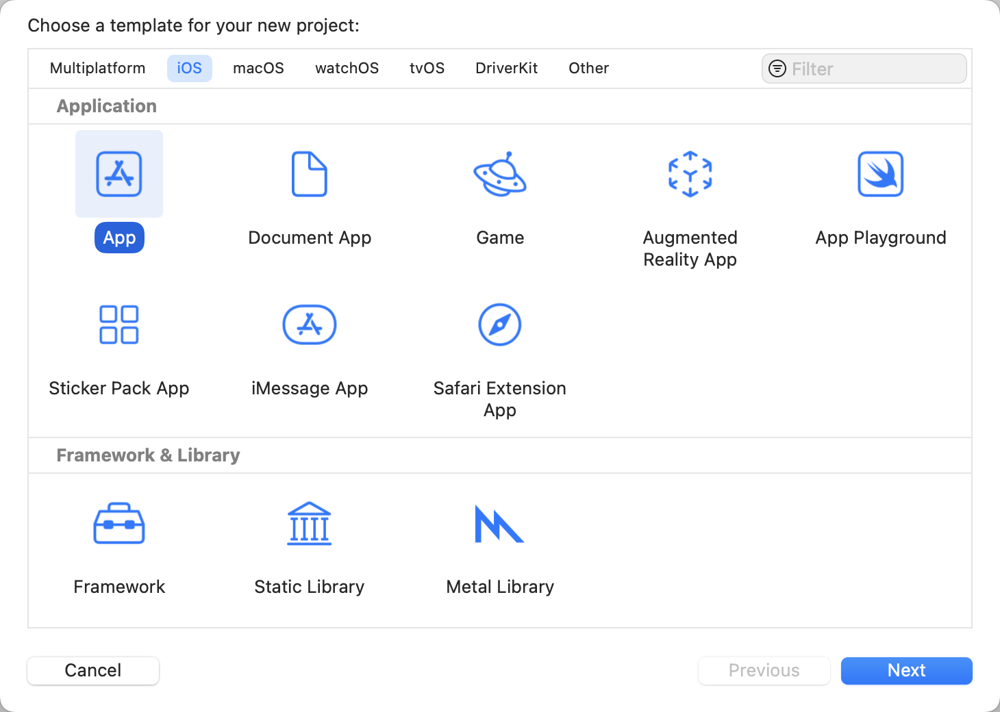
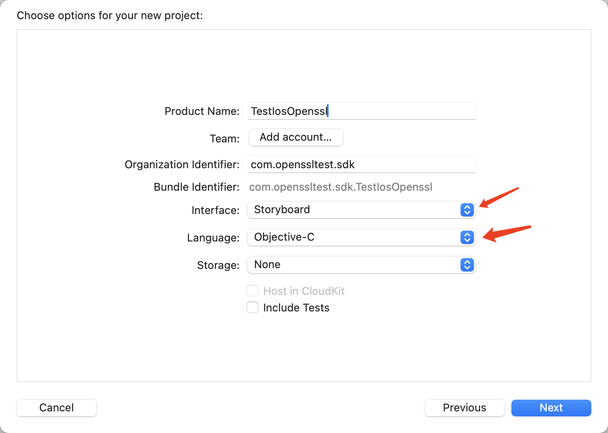
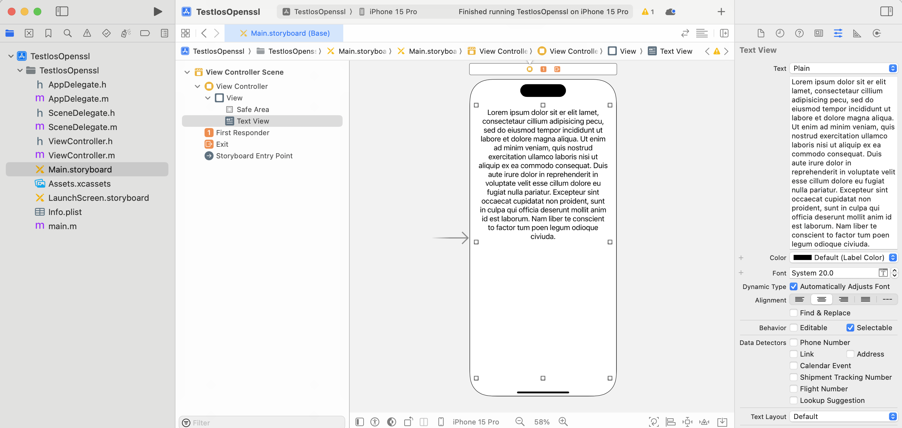
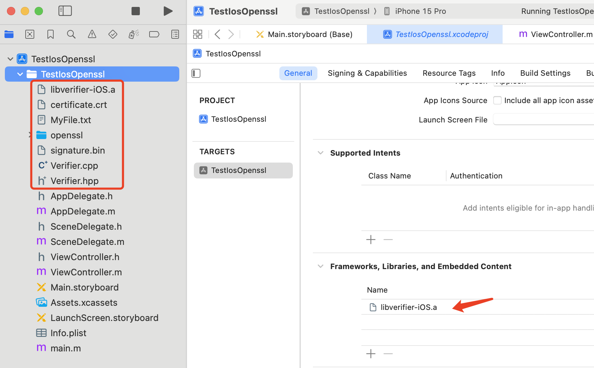
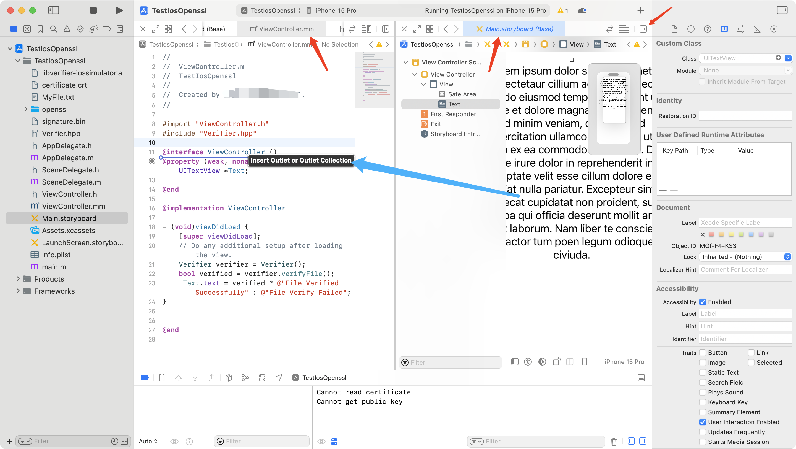
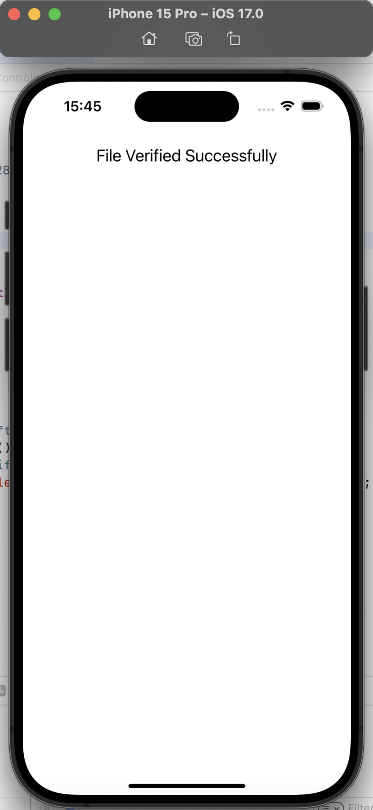

# iOS

需要先完成 [MacOS OpenSSL 构建](../MacOS/README.md)。

## 构建 iOS 测试项目

Xcode 里新建一个项目，选择 iOS App：



Interface 选择 `Storyboard`，Language 选择 `Objective-C`：



选中左侧 `Main.Storyboard`，给 View 里添加一个 Text View，调整一下大小、字体啥的。



把前面项目里用到和生成的文件加入到这个新项目：


⚠️ 截图里的 `Verifier.cpp` 文件并不需要……`openssl` 目录下的静态库也都删掉只保留 `include` 目录内容。

因为我们的库是 C++ 的，所以把引用头文件的 `ViewController.m` 文件名称改为 `ViewController.mm`。

选中左侧 `Main.Storyboard`，点击右上角的添加编辑器图标，这样 Xcode 就分屏成左右两边了。左边选择 `ViewController.mm`，右边还是 `Main.Storyboard`，然后点击前面创建的 Text View，按住 **Ctrl** 键，拖动鼠标到左侧编辑器合适位置，这样一个 Property IBOutlet 就自动创建了，命名为 `Text`：



修改 `ViewController.mm` 代码如下：

```objectivec
#import "ViewController.h"
#import "Verifier.hpp"

@interface ViewController ()
@property (weak, nonatomic) IBOutlet UITextView *Text;

@end

@implementation ViewController

- (void)viewDidLoad {
    [super viewDidLoad];
    // Do any additional setup after loading the view.
    Verifier verifier = Verifier();
    bool verified = verifier.verifyFile();
    _Text.text = verified ? @"File Verified Successfully" : @"File Verify Failed";
}

@end
```

编译运行项目：



**注意**：如果是使用**模拟器**，那么静态库需要使用前面构建的 `libverifier-iossimulator.a`，**真机**则需要改为 `libverifier-iOS.a`。
